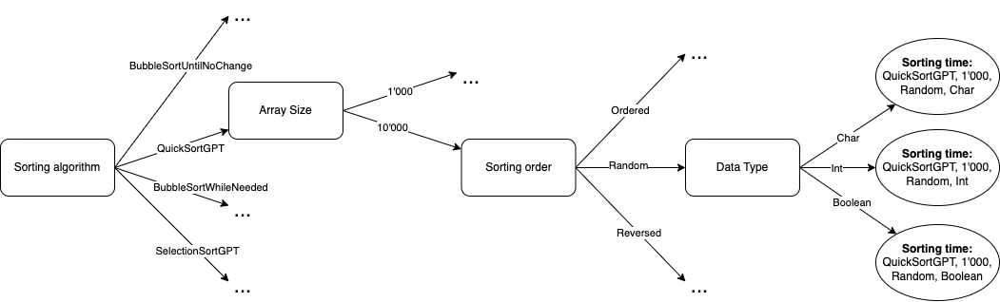

# Your Title Here

## Experiment 1, Experimentation & Evaluation 2024

# Abstract

> Short (120-130 words) summary of your entire report. Give the reader a quick idea of what you did and what the main findings were (if you prepare this report ahead of time, leave out the findings until after you finish the analysis).

# 1\. Introduction

<!-- > Introduce the topic of investigation to the reader and motivate why you did the experiment. Note that in our case, writing “because I was told to by the course instructor” is not a valid answer. Please assume that you are trying to answer a certain relevant question and motivate its relevance. (In a “real” study report, you would need to also discuss any relevant prior research results here. Given our setting, however, we skip any “related work” consideration.) Your final paragraph of the introduction should outline your proposed experiment. -->

In this experiment, we aim to answer an important question: *Which sorting algorithm implementation in Java is most efficient?* Efficient sorting is critical in computer science because many applications rely on sorting as a fundamental operation, whether in data processing, search optimization, or user interfaces. Selecting the most effective sorting algorithm can significantly impact the performance of these applications, especially when handling large datasets. 

In this study, we will analyze several Java sorting algorithm implementations with distinct characteristics: 
- BubbleSortUntilNoChange
- BubbleSortWhileNeeded
- QuickSortGPT
- SelectionSortGPT

To determine the best sorting performance, we will compare the algorithms by measuring the time required to sort arrays of varying sizes and data types. To enhance the reliability of our findings, we will average sorting times across multiple repetitions for each scenario.

By examining the efficiency of each algorithm in this way, we hope to provide insights into which implementation is most suitable for different use cases.

Hypothesis
---
<!-- >
> Write down your (falsifiable\!) hypotheses here. Each hypothesis must include **independent** and your **dependent** variables. You must write down your hypotheses **before** you do your experiment\! | -->

QuickSort algorithm is the best in terms of performances since his complexity is $O(n*logn)$; compared to BoubleSort $O(n^2)$ and Selection Sort $O(n^2)$. We expect this behaviour for every data type, array size and starting array order.

# 2\. Method

In the following subsections, describe everything that a reader would need to replicate your experiment in all important details.

## 2.1 Variables

| Independent variable | Levels | Description |
| :---- | :---- | ----- |
| Different algorithms | 4 | 4 different algorithms |
| Data Types | 3 | Integer (4 bytes), Char (2 byte), Boolean (1 bit)|
| Size of the array | 2 | Integer number, we selected 1'000 and 10'000 |
| Starting array order | 3 | If the initial array is already sorted, shuffled, or reverse-sorted |

---

| Dependent variable | Measurement Scale | How is mesured? |
| :---- | :---- | ----- |
| Time to complete the sorting | nanoseconds | `System.nanoTime()` |

---

| Control variable | Fixed Value |  |
| :---- | :---- | ----- |
| Number of active processes | from 90 to 100 processes (in idle) | |
| Computer HW, Os, JDK | i7-9700k, 32GB RAM, Windows 10, OpenJDK 23.01 | |

## 2.2 Design

Check off the characteristics of your experimental design:

**Type of Study** (check one):

| [ ] Observational Study | [ ] Quasi-Experiment | [x] Experiment |
| :---- | :---- | :---- |

We are conducting an **experiment** because we are actively *manipulating the independent variables* (i.e., we observe how performance changes with different sorting algorithms, data types, array sizes, and initial orders). This manipulation allows us to examine cause-and-effect relationships between these variables and the time taken to sort.

Additionally, we are using **randomization** in our experimental design. The data used to populate the arrays for each trial are generated randomly, ensuring that each algorithm operates on arrays that are equivalent in content and structure for a given data type and size. This helps balance out any potential biases or differences, as each algorithm sorts the same sets of data under comparable conditions.

We also have **control conditions**, where we can compare each algorithm's performance as a benchmark or "status quo" against others within the same experimental conditions. This allows us to determine if certain algorithms outperform others or if the effects vary based on the data characteristics.

**Number of Factors** (check one):

| []   Single-Factor Design | [x]   Multi-Factor Design | []  Other |
| :---- | :---- | :---- |

Our experiment uses a **Multi-Factor Design** since we are manipulating multiple *independent variables* to observe their effect on the dependent variable; the sorting time.  
This design allows us to to observe the effect of all independent variables on the dependent variable. 
By analyzing all combinations we are performing a *Full factorial design*  resulting into: $\#algorithms*\#dataTypes*\#sizes*\#startinOrders = 4*3*2*3=72$ different results.  
To visualize this concept we can imagine it like a flowchart diagram, where each dependent variable is a state with $n$ possible outcomes from it; as it follows (to avoid drawing all 72 possible paths, we have simplified the drawing following the path only of *QuickSortGPT, 1'000, Random, ...*):

<!-- Explain, (1) in text using terminology from the book and lectures **and** (2) with a figure (similar to those used in Chapter 3 of the Field & Hole book), what kind of experiment you did. -->

## 2.3 Apparatus and Materials

<!-- > Describe in sufficient detail any relevant “props” that you used in your experiment. This could be the computer you used (exact model and specification), the software used (URL, version numbers), the way you measured, e.g., time (A stopwatch? A background process on the computer that got automatically triggered?). Omit needless detail (e.g., think whether details like the size of the table the laptop was placed on, or the hard disk size, might have affected your results or not). -->

We will run all experiments on a desktop computer with the following HW specs:
- CPU: intel core i7-9700k
- RAM: 32GB ddr4

The computer runs on Windows 10 as OS but all the experiments and the JDK are runned throught the WSL with Ubuntu 23.04.

We are using as java version, OpenJDK 23.01. For all experiments performe, we save all metrics in a CSV file and plot them using the JavaScript API **chart.js** availlable on the website https://www.chartjs.org/.

To mesure the metrics of the experiments we use the java function `System.nanoTime()` and we save the value before and after the sorting; the elapsed time is so computed as `startTime-endTime`.

## 2.4 Procedure

<!-- Describe how you used your props and/or the participants to perform your actual experiment, i.e., how you actually carried out a single experimental run. What was done to the participants? What did they have to do? How long did each session take (unless this is an actual dependent variable)? If you did not have participants, explain, e.g., what software was started by whom in what order. -->

As first step, we set the size of the array and the number of sorting that has to be performed for each algorithm. We create three versions of each type of arrays: one randomly filled, one filled in-order (i.e. already sorted) and one filled in reverse-order.  
Then we perform the sorting for each algorithm for the choosen number of repetitions saving the result (i.e. the time needed to sort) of each repetition, and we do so for all the three types of arrays, and for all the "order version" of the arrays.  
At the end, we save this metrics in a dedicated file for all the combinations of arrays (type-size-order) having as column the times of each of the algoithms.

# 3\. Results

## 3.1 Visual Overview

> Provide an insightful overview of the data you collected. This requires some engineering from your part, to find a good degree of summarization: On one end of the spectrum, you don't summarize, and report hundreds of raw measurement values in a block of text. On the other end of the spectrum, you report a single number (like a mean value). Both approaches are bad.

> Instead, use appropriate visual summaries (such as **scatter plots**, **histograms**, **box plots**, or **empirical cumulative distribution functions**) to show the distribution of your data. If you have a very small number of measurement values, then report all of them in a **well organized table** (where rows and/or columns correspond to different levels of different factors).

## 3.2 Descriptive Statistics

> For each group or condition, summarize the set of measured values with a "five-number summary": **minimum**, **first quartile**, **median**, **third quartile**, and **maximum**.

> Make sure you explain – in your words – what these statistics mean “in plain English”, but don’t yet interpret them (this is for the Discussion section).

# 4\. Discussion

## 4.1 Compare Hypothesis to Results

> Provide a brief restatement of the main results from the previous section, and if (or if not) these support your research hypothesis.

> If there is a discrepancy between your hypothesis and the results of your experiment, speculate about why you were unable to find evidence to support your hypothesis.

## 4.2 Limitations and Threats to Validity

> Acknowledge any faults or limitations your study has, and how seriously these affect your results. How could these be remedied in future work?

## 4.3 Conclusions

> End with the main conclusions that can be drawn from your study.

# Appendix

# A. Materials

Any documents you used for your informed consent (information sheets, consent) or as part of your apparatus (e.g., manual, hand-out), please include them here.

# B. Reproduction Package (or: Raw Data)

Before, during, and after the experiment you collected all kinds of data. Don't ever throw such data away\! Any plots, tables, summaries, and statistics provided in this report should be recreatable from the raw data you have.

If you only collected a small amount of data, put it in this Appendix right here.

If you collected data in forms that are better kept in separate files, then zip up those files, and submit them as a "reproduction package" supporting this report.
